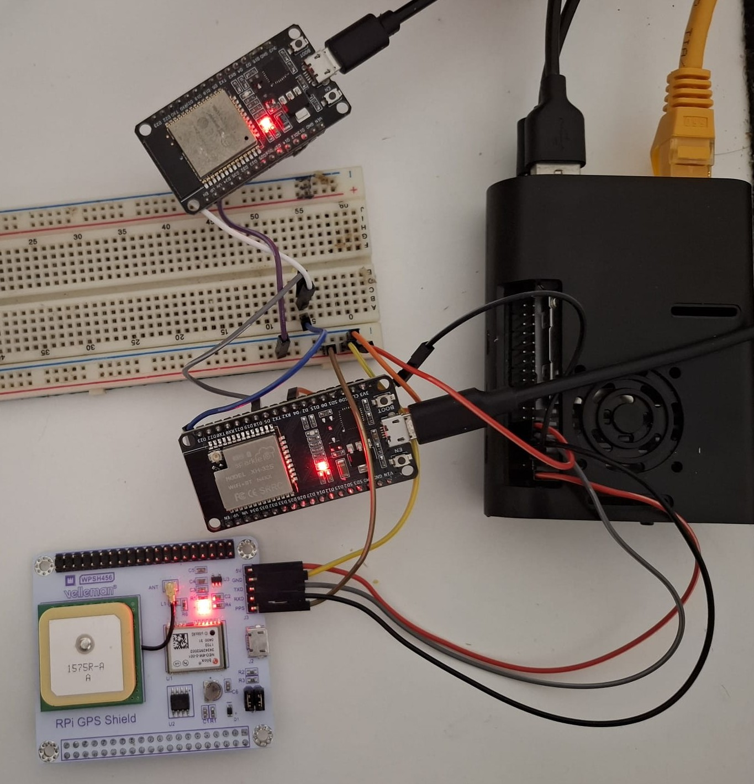
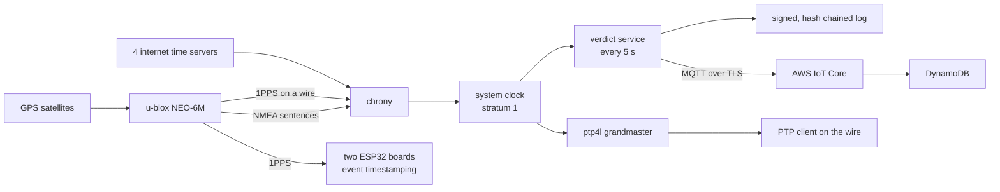
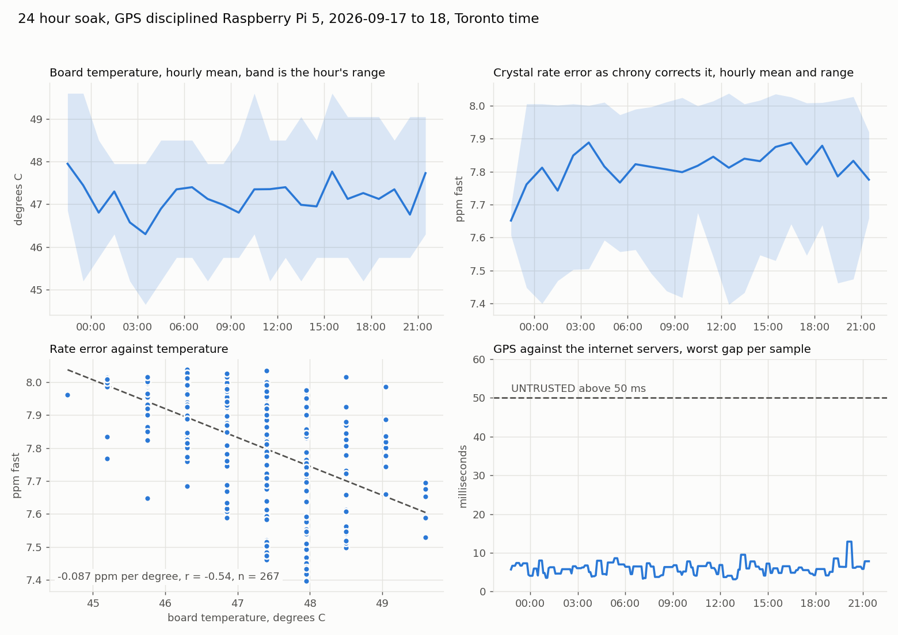

# GPS Time Integrity: a clock that checks itself

A GPS-disciplined clock that says when it can be trusted. A Raspberry Pi takes time from the satellites two ways, the text sentences over a serial port and a hardware pulse on a wire, and steers its own clock to both. It then cross-checks the result against four independent internet time servers, decides every five seconds whether the clock is sound, and appends that verdict to a log where each entry is chained to the one before it and signed on the device. Two ESP32 boards share the same pulse and stamp events against it, and the Pi serves the time onward to the network as a PTP grandmaster.



**Tech stack:** Raspberry Pi 5 embedded Linux, chrony and gpsd, a u-blox NEO-6M over UART with a 1PPS line, the kernel PPS subsystem, a Python verdict service with SHA-256 chaining and Ed25519 signing, linuxptp grandmaster and client with hardware timestamping, ESP32 with the MCPWM capture peripheral, AWS IoT Core to DynamoDB, GitHub Actions CI with pytest

## What this is

Satellite time is the reference almost every timestamped system leans on, and it can be blocked, faked or left to drift while every machine downstream keeps stamping records that look fine. This build is the small version of the problem: a clock good to tens of nanoseconds, and a service whose whole job is to notice when that clock stops deserving the trust it is being given.

The Raspberry Pi and the ESP32 firmware workflow come from my earlier telemetry project, so the effort here went into the parts that were new to build: disciplining a clock off a hardware pulse, measuring holdover and crystal stability, the hash-chained and signed verdict log, running PTP on both sides of a cable, and timestamping an edge in hardware rather than in an interrupt.

## Highlights

- **Two independent references, continuously compared.** The satellites arrive two ways, and four internet time servers sit alongside them as a second opinion that GPS cannot influence.
- **A spoof that one reference cannot catch.** Shifting the receiver's claimed time by two minutes drags the honest hardware pulse with it. The comparison against the servers is what survives, and it is the reason the detector subtracts two offsets rather than trusting one.
- **A signed, tamper-evident log.** Every verdict carries the fingerprint of the entry before it and an Ed25519 signature made on the device, so an edited entry breaks the chain and a rebuilt chain still fails the signature.
- **Holdover measured rather than quoted.** Pull the antenna and the clock keeps its learned rate correction: 12 microseconds lost over 14 minutes, against 679 ms a day for the same crystal with nothing correcting it.
- **PTP on both ends of the wire.** The Pi runs as a grandmaster with hardware timestamping on its network card, and a Linux client on the far side of a switch follows it.
- **Hardware timestamping against a software interrupt.** One pin, stamped both ways at once, so the cost of doing it in an interrupt handler is a measured number rather than an assumption.
- **Two microcontrollers on one time base.** Both boards stamp the same event against the shared pulse and agree to within 1.2 microseconds once each board's own crystal is applied.
- **Tests and CI.** Ten tests run on every push, none of them needing the hardware, because the parts that decide and the parts that prove are pure functions over data.

## Architecture



The text sentences say which second it is and arrive about 119 ms late. The pulse says exactly when that second starts and carries no date. chrony takes the second number from the sentences and the instant from the pulse, which is why the two are configured together and why only one of them is allowed to steer the clock.

## Catching a faked receiver

Healthy. The pulse and four internet servers all agree, within milliseconds.

```
MS Name/IP address         Stratum Poll Reach LastRx Last sample
#? NMEA                          0   3     7     5  -3438us[-3437us] +/-  100ms
#* PPS                           0   2    77     4   +649ns[+1294ns] +/-  446ns
^- archer.fsck.ca                2   6    17    19  -4056us[ -951us] +/-   11ms
^- ntp.netlinkify.com            2   6    17    19  -5600us[-2827us] +/- 8838us
```

The receiver is then fed a time two minutes wrong. Same command, moments later.

```
#? NMEA  reach 37   -120.1s      the receiver, lying
#* PPS   reach 377  -120.0s      the hardware pulse, carrying the lie
^- tangent.muug.ca  -7740us      the internet server, unmoved
```

```
10 UNTRUSTED | compared against PPS | satellite vs servers 119.997858 s
```

Every offset chrony reports is measured against the system clock, so subtracting two of them takes the clock out of the question:

```
(GPS - clock) - (server - clock) = GPS - server
```

The service compares the satellite source against each server and calls `UNTRUSTED` when the largest gap passes 50 ms, about four times the worst healthy disagreement measured over 23 hours. Comparing each source against the system clock instead fails exactly when it matters, because a spoof that drags the clock along makes the honest servers look like the liars.

[`tools/spoof_shm_time.py`](tools/spoof_shm_time.py) writes a chosen offset into the gpsd shared memory unit that chrony reads, which is the interface a spoofed receiver's time arrives through. Nothing is transmitted over the air.

## The verdict log

Each entry carries `prevHash`, its own `hash` over the previous fingerprint plus its contents, and an Ed25519 signature made with a key held on the device. The chain gives ordering and tamper evidence. The signature gives origin, because a forger who recomputes every fingerprint correctly still cannot sign.

```
python3 service/verify_log.py logs/verdict_log_signed_2026-09-17.jsonl service/device_key.pub
```

A real entry is in [`logs/sample_verdict_entry.json`](logs/sample_verdict_entry.json). The verdict is one of four words:

| state | the fact behind it |
|---|---|
| `WARMING` | the receiver has no fix yet |
| `LOCKED` | the pulse is the chosen reference and a sample arrived within the last minute |
| `HOLDOVER` | no recent pulse, the clock running on the rate it learned |
| `UNTRUSTED` | the pulse is alive and a server disagrees by more than 50 ms |

## Specs

| Category | Value |
|---|---|
| Receiver | u-blox NEO-6M, NMEA at 9600 baud plus a 1PPS output |
| Disciplining | chrony, PPS as the reference and NMEA as the second number |
| Stratum | 1, its own reference |
| Verdict interval | every 5 seconds, written on a state change plus a 5 minute heartbeat |
| Alarm threshold | 50 ms between the satellite source and any internet server |
| Log integrity | SHA-256 chain plus Ed25519 signature per entry |
| PTP | linuxptp grandmaster, UDPv4, hardware timestamping, `clockClass 6` |
| Event timestamping | ESP32 MCPWM capture at 80 MHz, 12.5 ns resolution |
| CI | GitHub Actions runs pytest on every push |

## Results

| what | measured |
|---|---|
| system clock against the pulse, 23 hours locked | 71 ns median, 744 ns worst |
| clock drift with the antenna removed, 14 minutes | 12 microseconds |
| clock drift with the antenna removed, 70 minutes | 577 microseconds, so the error grows faster than a straight line |
| the same crystal with nothing correcting it | 7.86 ppm, which is 679 ms a day |
| a two minute spoof | detected, satellite against servers 119.998 s |
| worst disagreement between sources in 24 hours | 12.9 ms, about a quarter of the alarm threshold |
| network card clock against the system clock (PTP) | 64 ns |
| a PTP client over one unmanaged switch | 38 microseconds median |
| hardware capture against software interrupt, same edge | 52 ns against 420 ns of jitter |
| the same two paths under a high edge rate | capture recorded 96,190 edges in 35 s, the interrupt recorded 43,089 |
| two ESP32 crystals, hourly means across 3.3 hours | +22.0 and -4.0 ppm, each holding within 0.12 ppm |
| cold start to first fix, indoors at a window | 11 minutes. Hot restart: fix in 9 s, pulse in 16 s |



The 24 hour run's procedure and pass criteria are in [TEST_PROCEDURE.md](TEST_PROCEDURE.md), raw logs in [`logs/`](logs/).

## Hardware

| Part | Role |
|---|---|
| Raspberry Pi 5 | the disciplined clock, the verdict service and the PTP grandmaster |
| Whadda WPSH456 GPS shield, u-blox NEO-6M | satellites in, NMEA over UART and 1PPS on a separate wire |
| ESP32 DOIT DevKit V1, two of them | event timestamping against the shared pulse |
| TP-Link TL-SG1005D | 5 port gigabit switch, the Pi and the PTP client on one run |

Bought for this build: the GPS shield at 59.95, the switch at 29.95 and two Cat6 cables at 5.90, CAD 108.25 with tax. The Pi, both ESP32 boards, the jumpers and the breadboard came from earlier projects at about CAD 250, so the whole rig is around CAD 360.

## Build and run

Wiring, the Pi configuration and the things that are easy to get wrong are in [SETUP.md](SETUP.md). In short:

```bash
sudo apt install gpsd gpsd-clients chrony pps-tools
# two dtoverlay lines in /boot/firmware/config.txt, gpsd pointed at /dev/ttyAMA0,
# and a chrony refclock pair, all in SETUP.md
python3 service/make_device_key.py
sudo systemctl enable --now gps-verdict
```

```bash
pytest tests -v
```

## Repo structure

```
service/                the verdict service, its systemd unit, key generation, the log checker
firmware/pps_crystal/               measures an ESP32 crystal against the pulse
firmware/two_board_event/           two boards stamping one shared event, reporting over WiFi
firmware/capture_vs_interrupt/      one pin stamped by hardware capture and by a software interrupt
tools/                  the AWS publisher, the spoof injector, an NMEA time shifter, listeners and analysers
tools/aws/              the IoT and IAM policy documents for the cloud path
tests/                  the ten tests
logs/                   every measured run, the soak chart, a sample log entry
SETUP.md                wiring, Pi configuration, and what is easy to get wrong
TEST_PROCEDURE.md       the 24 hour run: procedure, pass criteria, results
```

## Known limitations

- **The pulse is estimated, not calibrated.** chrony puts it at about 400 ns, and there is no better reference on this bench to check that against. Every absolute figure here inherits that.
- **The 38 microsecond client figure carries two penalties.** The TL-SG1005D is unmanaged, so its queueing delay lands in the number with nothing correcting it, and the client's Realtek adapter has no PTP hardware clock, so that end timestamps in software. The 64 ns figure is the server's own network card, which is the clean comparison.
- **Holdover is a plain crystal.** There is no oven-controlled oscillator here, so the 12 microseconds over 14 minutes is what an ordinary Pi does, not what a timing appliance would do.
- **One field in the log is wrong.** Entries carry `satellitesUsed: 0` alongside `gpsMode: 3`, which is a 3D fix. The state logic uses the pulse and chrony rather than that count, so no verdict depends on it, but it is a wrong number inside a signed record.
- **The cloud path is a demonstration.** Verdicts reach AWS IoT Core and land in DynamoDB, on a credits-based account that is not kept running indefinitely.

## Background and contact

Built in September 2026, on the embedded and instrumentation side of my earlier biosignal work:

- STM32 myoelectric gripper (bare-metal firmware, CAN, FreeRTOS): https://github.com/KenKadilar/STM32-EMG-Biosignal
- EMG telemetry edge node (embedded Linux, MQTT, a kernel driver): https://github.com/KenKadilar/EMG-Telemetry
- MyoCell, a biosignal-driven robotic sorting cell (PLC, Modbus, machine vision): https://github.com/KenKadilar/MyoCell
- Journal article (IJANSER, 2024): https://as-proceeding.com/index.php/ijanser/article/view/1728
- Extended arXiv preprint: https://arxiv.org/abs/2504.15256

**Ken KADILAR** - embedded / precision timing / Linux  
Portfolio: [canarchive.com](https://canarchive.com)  
LinkedIn: [ken-kadilar](https://www.linkedin.com/in/ken-kadilar/)  
Email: kenkadilar@gmail.com
